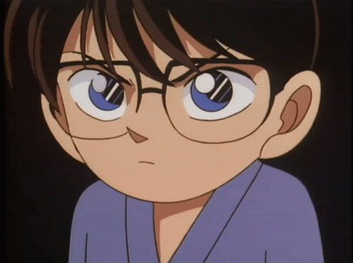
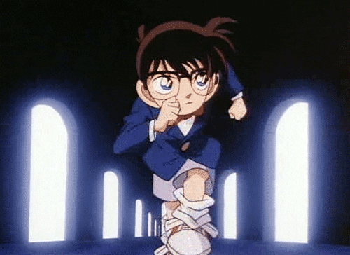
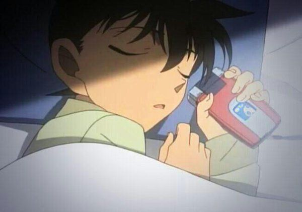
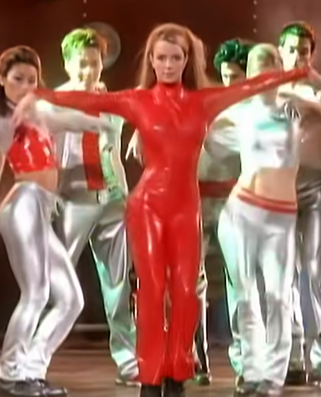

# Sprint Crypto 2022 
Bien le bonjour cher lecteur ! Mon nom est Zuriel et tu t'apprêtes à lire ma folle aventure autour du sprint de cryptographie de 2022. Voici mon histoire.

  

`5h30 -` Je suis malencontreusement tombé de mon lit ce matin, heureusement rien de cassé, je file me préparer pour les 2 journées qui m'attendent ! 

`7h00 -` J'arrive au batîment 3ia, lieu ~~de torture~~ où l'affrontement va avoir lieu durant 2 jours. Je me suis levé tôt afin de faire un bon gros tour du batîment et de voir si les malins professeurs n'auraient pas laissé quelques pistes avant de filer en week-end.

`8h00 -` C'est parti ! J'ai vu Mr.Chapelle en détective scotcher des affiches suspectes sur les portes et je m'empresse de scanner le qrcode qui se trouve sur ces dernières. Hop aussitôt j'ai le réflexe d'analyser l'image, on y voit clairement un message en base64 que je m'empresse déchiffrer. **Premier Token** !
 
`8h05 -` Lancement du runme.pyz, token trouvé via l'error404, **Deuxième Token** ! 

## Chapitre 1 - La disparition d'Alice - Lundi 8h00

 `8h07 -` Zut ! L'excitation m'a presque fait oublié que je m'appelais Zuriel, en me posant dans la canapé l'enceinte s'allume et m'annonce la disparition d'Alice, je m'empresse d'aller dans son bureau pour y comprendre quelque chose.
 
  `8h13 -` Là ! Derrière la plante, un **Token**, le **Troisième**, je commencé mon enquête avec 3 séries de 24 lettres majuscules, plus que ... ah ben non j'en sais rien enfaites. 
  
  `8h36 -` Quelqu'un semble avoir laisser quelques indices près de la clé USB, du livre pour les nuls et d'une affiche sur Vernam, cette dernière me donne un **Quatrième Token** en y enlevant un peu de couleur
  
 `9h03 -` Le livre était en réalité une archive, hop on zippe ça puis on dézippe afin d'avoir une notice qui sera certainement utile pour plus tard. On trouve sur cette dernière un **Cinquième Token** !
 *Ringg Ringggg*~ 
 
 Un appel masqué ? Allo ? Un **Sixième Token** dans le code source de la page perdu ? Très bien c'est reçu, merci pour cela ! 
 
  `9h41 -` Le git mit dans la notice m'a permit de trouver le mot de passe afin d'obtenir le contenu de la clé qui contenait des mails entre Alice et Bob, **Septième Token** parmi ces derniers.
  
 `10h11 -` Le rail m'a bien fait tourner (en zigzag) avant que je trouve son **Token** qui est le **Huitième**. 
 
 `10h42 -` Petite pause, une odeur agresse mes narines, tiens tiens tiens un morceau de Beaufort, j'en ais fais qu'une bouchée et hop un **Neuxième délicieux token**. 
 
 `11h10 -` Je reprend le travail... Mon amie est quand même peut-être en danger, pas le temps de chômer ! Je décide alors d'analyser plus profondément nos mails et,  après inspection, on trouve 3 qr codes à l'aide d'une image.
 Par expérience, je sais que les chances que Rick Astley ou qu'une CAKE se cache derrière ce qr code sont très élevés... Mais... je... prend ce... risque... et...
  
  ~~à votre âge voyons...~~ Hahaha, Rick Astley je m'y attendais pas à celle là. Heureusement, je ne repars pas bredouille car l'entête d'un de ces qrcodes contient quelque chose de suspicieux qui s'est avéré être mon **Dixième Token** suivi d'un lien.
 
 `11h45 -` La faim commence à se faire ressentir... 
 Désolé Alice, mais ta disparition attendra que je me remplisse  la panse avec un énorme sandwich, j'en profite pour commencer à rassembler les éléments trouvés et regarder si j'ai rien oublié derrière moi.

 `12h40 -` J'ai incroyablement bien mangé accompagné de quelques amis détective avec qui j'ai pu partagé de nos difficultés et de l'avancement de nos missions. Le nombre d'Alice qui disparaît de nos jours... c'est fou quand même...

 `14h30 -` En analysant la page calosoma, on y découvre deux textes chiffrés en Vigenère (clé :grapes:), ce qui n'a pas posé de réel problème, puis une suite de nombres groupés par 3. Un des deux Vigenère semble m'indiquer d'aller chercher dans le livre 1984 de George Orwell. Il me donne par ailleurs mon **Onzième Token**.
 J'ai compris plus tard que les trios de chiffres x-y-z servent à chercher à la x-ième page, à la y-ième ligne et au z-ième mot afin de retrouver des coordonnées géographiques menant à des affiches postées notamment à l'extérieur.
 En rentrant les coordonnées en url comme indiqué, j'obtiens un **Douzième Token** et des emplacements à aller se déplacer afin d'obtenir des qrcodes fournissant des pistes du côté de RSA, effrayantes ces trois lettres réunies ensemble, ne trouvez-vous pas ?

## Chapitre 2 - Mise sur écoute - Lundi 16H00
 L'heure tourne et de nouveaux indices me parvienne sur la disparition d'Alice, j'espère qu'elle va bien...

 `16h15 -` Mince ! Il est 16h passé, j'ai pas fais attention à l'heure à cause du CBC à faire, heureusement que j'ai réussi à l'effectuer et à trouver qu'un fichier du dossier indices correspondait à la clé TOKEN et qu'il m'a renvoyé mon **Treizième Token**. Mais il y a encore pas mal de mots à trouver pour trouver toutes les correspondances... (CAKE/TOKEN/FAT/PNG/QRCODE/IMG/RSA/7Z/XOR/LSB/EXT2)

 `16h20 -` C'est à peine reposer sur le canapé que l'enceinte se remet en marche et m'informe l'arrivée de nouveaux éléments confidentiels pour mon enquête, aussi je me relève et c'est reparti !

  
 
 `16h25 -` Après avoir récupérer le contenu du disque d'Alice, j'ai été intrigué de voir une image avec un icone poubelle dessus, et en faisant un xxd de cette dernière, j'ai trouvé mon **Quatorzième Token** en fouillant. De plus, en superposant cette image, nous avons trouver un **Quinzième Token** !
 
 `17h36 -` C'est génial j'ai trouvé pas mal de choses sur son disque.
 Tout d'abord, des trames d'une communication entre elle et Bob, en filtrant et en récupérant seulement ce qui nous interesse, j'arrive à trouver mon **Seizième Token** à travers ces communications. 
 Ensuite, en parallèle, j'ai vu qu'Alice avait un dossier qui possèdait un git. J'ai donc regardé le config et ait pu récupérer mon **Dix-Seiptième Token** 
 J'ai eu la bonne idée de pull ce projet là et après le pull, le read.me qui s'est mis à jour contient un autre **Token**, mon **Dix-huitième** !
 Mais dans qu'elle état il était avant ? 
 Dans la foulée j'obtiens mon **Dix-neuvième Token** en faisant un reset du répo git d'Alice.

 `17h50 -` Un message m'est parvenu il y a quelques minutes avec un paquet de détergent et du liquide vaisselle, j'obtiens un **Vingtième Token** sur cette dernière. Y-a-t'il un message subliminal derrière ? 

 À partir de là, les pistes furent plus rares et je suis retourné sur mes pas pour voir où est-ce que j'ai oublié d'aller fouiller

 `21h30 -` **Vingt-et-unième et dernier Token** de ma première journée d'investigation en retournant sur l'image du message envoyé et signé par 4217.

 `23h -` Il fait nuit, la journée fût fructueuse. La fatigue est présente mais il faut que je me repose pour être en forme demain ...

 `2h30 -` ... Après avoir fini de commencer à rédiger mon journal de bord.

 

`4h30 -` ZZZZzzzzZZZZZ AAllliiccceeee ZZZzzzZZZZZ TToookkeeennn ZZZZzzzZZZZ

`6h30 -` Le réveil est compliqué, Alice n'a pas quitté mes pensées de la nuit.

`7h02 -` C'est reparti, une image m'est parvenue avec une en-tête contenant cake, un message en base64 et ... ***DID IT AGAIN***

Mon **Vingt-deuxième Token** était dans l'entête de l'image codé en base64

## Chapitre 3 - Mise sur écoute - Mardi 8H00

`8h00 -` C'est parti pour cette deuxième journée d'enquête pour retrouvé Alice. Eve nous a trouvé des éléments contenu dans le cloud d'Alice.
Du contenu y était stocké avec une langue incompréhensible que l'on s'est empressé d'attaquer

`12h30 -` Les messages runiques m'ont donné beaucoup de mal... Oh une bandelette par terre avec une ligne en base32. **Vingt-troisième Token** trouvé !

`13h30 -` Enfin ! J'ai enfin réussi à déchiffrer de charabia, les pays nordiques, plus jamais ! J'obtiens mon **Vingt-quatrième Token** !

`15h00 -` En retournant sur les messages d'Alice et Bob d'hier, j'obtiens un **Vingt-cinquième** et dernier **Token**.

